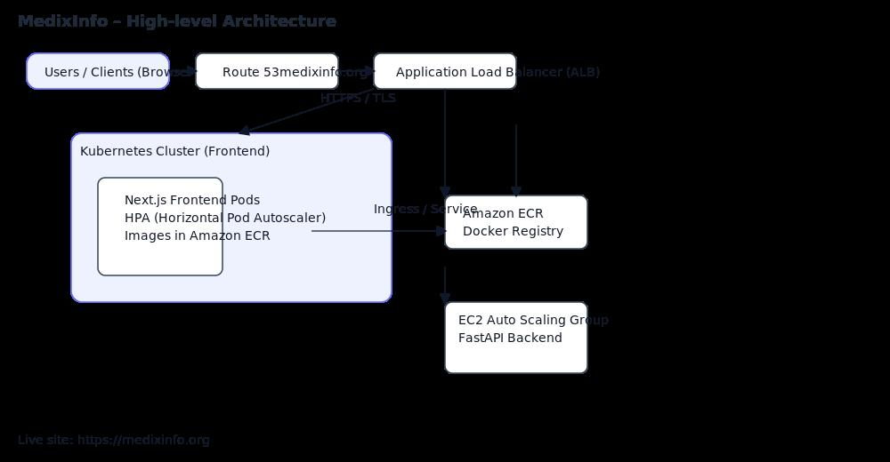

# MedixInfo – Health Information Management System
**Domain:** medixinfo.org  
**Status:** Source code is stored in a **private repository**. This public documentation outlines the system design, cloud architecture, DevOps workflows, and engineering processes implemented by the Cloud/DevOps Engineer.


---

## 🚀 Project Overview

**MedixInfo** is a cloud-native **Health Information Management System (HIMS)** that enables healthcare facilities to efficiently manage patient records, clinical workflows, authentication, and secure data exchange. Designed to modernize how hospitals, doctors, and patients manage medical information and appointments. The platform serves as a "digital health ecosystem" where all healthcare stakeholders can securely connect, share information, and coordinate care.

This README is intentionally public while the application source code remains in a private repository. The live system is reachable at: **https://medixinfo.org**

---

## 🖥️ Technology Stack

**Frontend**
- Next.js, React, TailwindCSS  
- Dockerized and orchestrated with Kubernetes  
- Horizontal Pod Autoscaling (HPA)  
- Container images hosted on Amazon ECR

**Backend**
- Python, FastAPI  
- Hosted on AWS EC2 instances within an Auto Scaling Group (ASG)  
- Application Load Balancer (ALB) for routing and TLS termination

---

## 🏗️ Architecture Diagram (SVG)
Below is the high-level architecture diagram (SVG). A downloadable copy is included next to this README.


## 🧰 My Responsibilities as Cloud/DevOps Engineer

- Designed and implemented the AWS architecture (Route 53, VPC, ALB, ASG).  
- Containerized the Next.js frontend and set up Kubernetes deployments with HPA.  
- Managed Docker images in Amazon ECR and automated image builds via CI.  
- Deployed FastAPI backend on EC2 instances with Auto Scaling and ALB integration.  
- Implemented monitoring (CloudWatch), health checks, and alerting.  
- Implemented secure HTTPS (SSL/TLS) and DNS configuration for **medixinfo.org**.  
- Ensured rolling updates and zero-downtime deployments.

---

## ⚙️ CI/CD - for the front end

GitHub Actions workflow (frontend) — builds and pushes Docker image to ECR:

```yaml
name: Deploy Frontend to ECR

on:
  push:
    branches: [ "main" ]

jobs:
  build-and-push:
    runs-on: ubuntu-latest

    steps:
    - name: Checkout repository
      uses: actions/checkout@v3

    - name: Configure AWS credentials
      uses: aws-actions/configure-aws-credentials@v2
      with:
        aws-access-key-id: ${{ secrets.AWS_ACCESS_KEY_ID }}
        aws-secret-access-key: ${{ secrets.AWS_SECRET_ACCESS_KEY }}
        aws-region: us-east-1

    - name: Login to Amazon ECR
      id: ecr
      uses: aws-actions/amazon-ecr-login@v1

    - name: Build Docker image
      run: |
        docker build -t medixinfo-frontend .

    - name: Tag image
      run: |
        docker tag medixinfo-frontend:latest ${{ steps.ecr.outputs.registry }}/medixinfo-frontend:latest

    - name: Push to ECR
      run: |
        docker push ${{ steps.ecr.outputs.registry }}/medixinfo-frontend:latest
```

---

## 📦 Deployment Summary

**Frontend**
1. Build Next.js app → Docker image → push to ECR  
2. Kubernetes Deployment pulls image → HPA scales pods as needed  
3. ALB or Ingress routes traffic to frontend

**Backend**
1. FastAPI service deployed on EC2 within an ASG  
2. ALB routes requests with health checks  
3. ASG scales EC2 instances based on metrics

---

## 🔐 Access & Contact

The repository is private. Access can be granted upon request.  
Live site: **https://medixinfo.org**

---

## 📄 License
MIT

